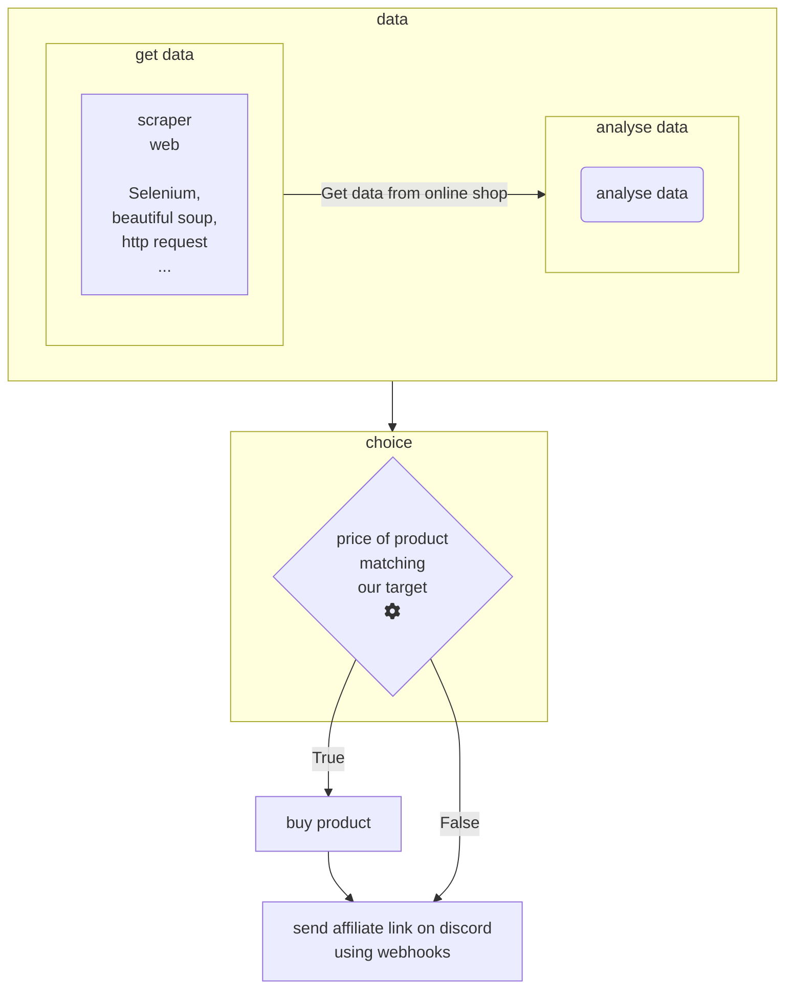

# Discord bot <!-- omit in TOC -->

## Summary <!-- omit in TOC -->

* [create discord server](create_server/Readme.md)
* [create application (bot & other) on discord](create_bot_app/Readme.md)
* [application authorization on discord](app_authorization/Readme.md)
* [create webhooks on discord](webhooks/Readme.md)

 

## Stack :

* discord.py
* http request
* flask
* webhooks
* asyncio
* python-dotenv
* replit
* sqlite3

 

## Features : 

* Send message/embed inside a discord server using bot/webhooks
* Receive webhooks request using flask
* Send webhooks request using http request
* host on replit using replit database
* host on our own device using sqlite3 for the database

 

## Why this project :

I do this little project for learn about bot in discord and how to automate message inside a discord server, retrieve users datas etc... 
One of my motivation is the fact I write a scraper wich will check availability on product that is difficult to buy such as (PS5, GPU, for example), my program is also able to buy automatically this higly valuable product but I'm not sharing that part. In fact, I was thinking that will be a good thing for next shortage, I create some passif income using :
* discord server 
* affiliate program
* scraper web
* youtube

So now I'm fully ready for next shortage and will be able to build a live youtube channel showing availability on product, maybe a website, and a discord server who will notify people about availability using affiliate link to earn some money from youtube view, and from affiliate program, and advertissement on website. For that the thinking behind is not that complex :

So that's not what I did in this project, but I have a personnal project where I monitor availability for GPU and buy if the price match my target. On this project I learn how to setup a discord server, how to create bot, how to send message using webhooks so I don't have that much change to arrive at this step.

A second point is the fact that's bot on discord can be sell for money, and they can be also available again a monthly payment. In this case, I guess you need to propose the same package than the other bots but with better functionnalities or maybe a price more attractive. For that you need a dashboard (web application) to configure our bot with a simple UI, you can use json and simple no-sql database to store the configuration of different users and have more flexibilities for futur changement, some monthly bot cost 12dollars month and are used on more than 30k server, so let's say if you create a good bot with nice functionalities and you succed to sell it to 100 peoples maybe 300 for 3dollars to 5dollars.

I think, discord can be really profitable. But in order to create a good bot, it's can take a lot of time so in order to earn value from this time, one of the solution can be to use fiver for example and propose your service for create custom discord bot, so during this process you can build functionnalities for clients and same time use it to continue our bot developement. 

 

## What I learn and pratice from this project :

From this project, I learn and practice mutilple thing :
* webhooks
* flask 
* replit
* python-dotenv
* asynchio
* discord.py
* sqlite

 

## Some reflexion about the project :

Discord bot can be really interesting for multiple purpose, automate thing for your workload, earning money passively, or just have fun creating bot to handle guild community for a game. The possibilities are almost unlimited on this field and doesn't require a high level skill.

 

___

## Source :

* [Code a Discord Bot with Python - Host for Free in the Cloud [FCC]](https://www.youtube.com/watch?v=SPTfmiYiuok)
* [create bot discord [discord.py]](https://discordpy.readthedocs.io/en/stable/discord.html)
* [discord developer documentation](https://discord.com/developers/docs/intro)
* [Online code editor : replit ](https://repl.it)
* [Discord Home Page](https://discord.com/)
* [Discord Developer Portal](https://discord.com/developers/applic)
