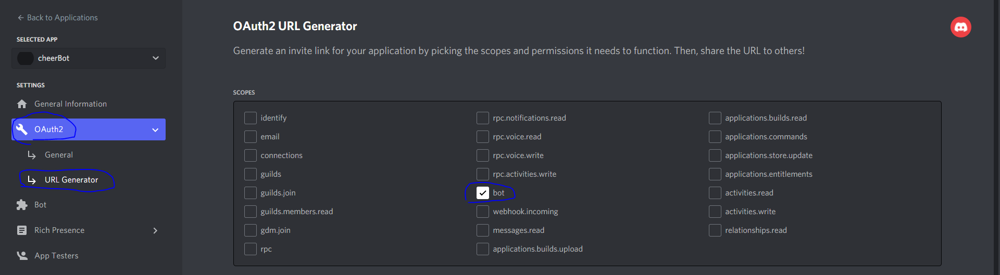
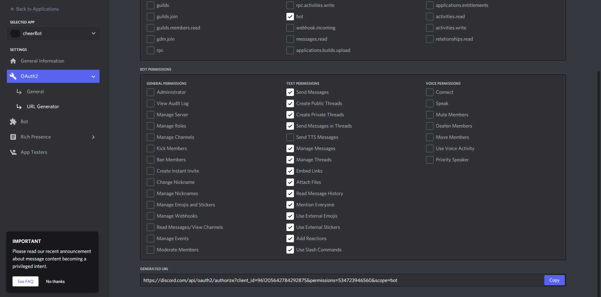
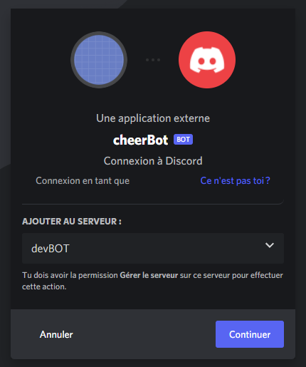

# Application Authorization 

1. Add the authorization you need for your application, and specify the type of your application. Here it's a bot, after that copy the generated URL.

 

2. Open a tab on your browser and go to the generated URL you just copy, then choose the server where you want to add your bot :

 
 

## Source :

* [Code a Discord Bot with Python - Host for Free in the Cloud [FCC]](https://www.youtube.com/watch?v=SPTfmiYiuok)
* [create bot discord [discord.py]](https://discordpy.readthedocs.io/en/stable/discord.html)
* [discord developer documentation](https://discord.com/developers/docs/intro)