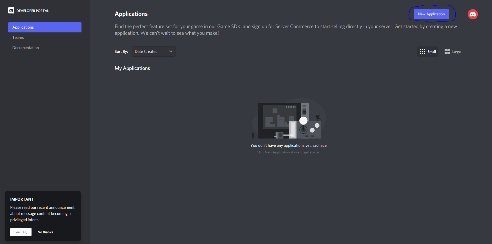
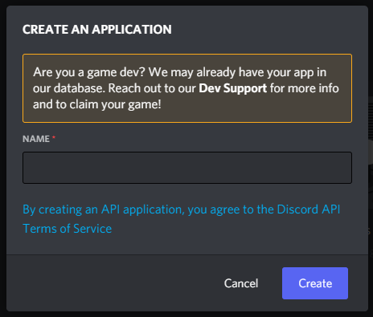
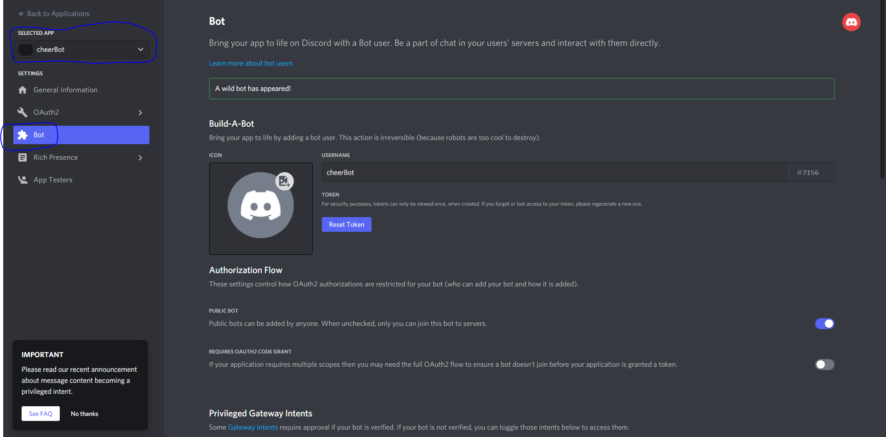
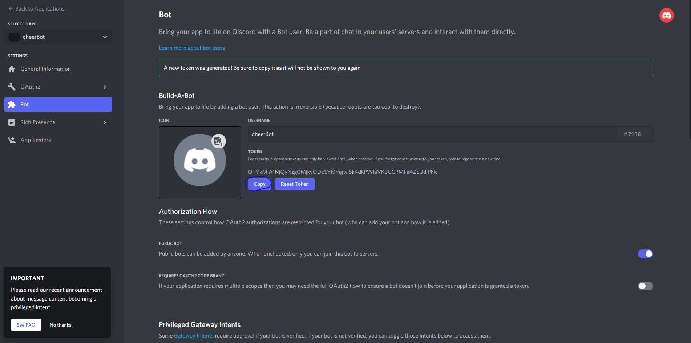

# How to create a bot <!-- omit in TOC -->

 

___

1. Go to : https://discord.com/developers/applications and click on <strong style="color:red">New Application</strong>

 

2. Name the application :

 

3. Create a new bot :

 

4. Copy the bot token :

* Token : {YOUR_TOKEN}

 
 

___

## Source :

* [Code a Discord Bot with Python - Host for Free in the Cloud [FCC]](https://www.youtube.com/watch?v=SPTfmiYiuok)
* [create bot discord [discord.py]](https://discordpy.readthedocs.io/en/stable/discord.html)
* [discord developer documentation](https://discord.com/developers/docs/intro)

