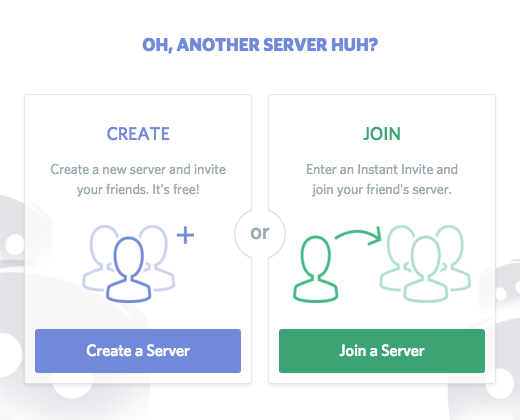
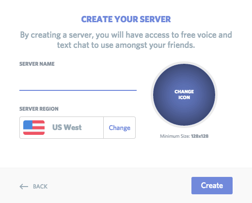
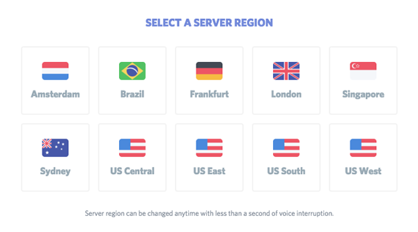
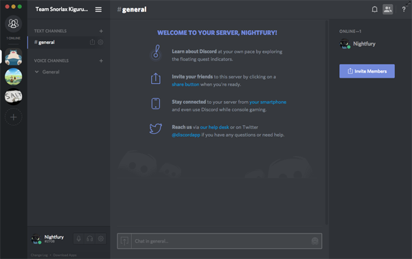

# How to create a discord server 

1. Click on the "+" button located in the left column : 

 

2. click on create :

 

3. complete server information :

* icon (The minimum size for icons is 128x128. If you want to select a specific part of a large image, cut it into multiples of 128 (128X2=256, 128X3=384, etc).
* select server region 

 
 

## Result

 
 

## Source :
* [official discord forum [FR]](https://support.discord.com/hc/fr/articles/204849977-Comment-cr%C3%A9er-un-serveur-)