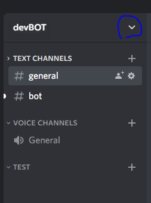
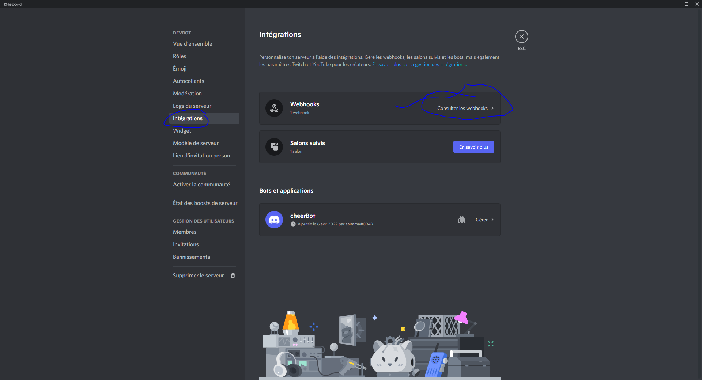
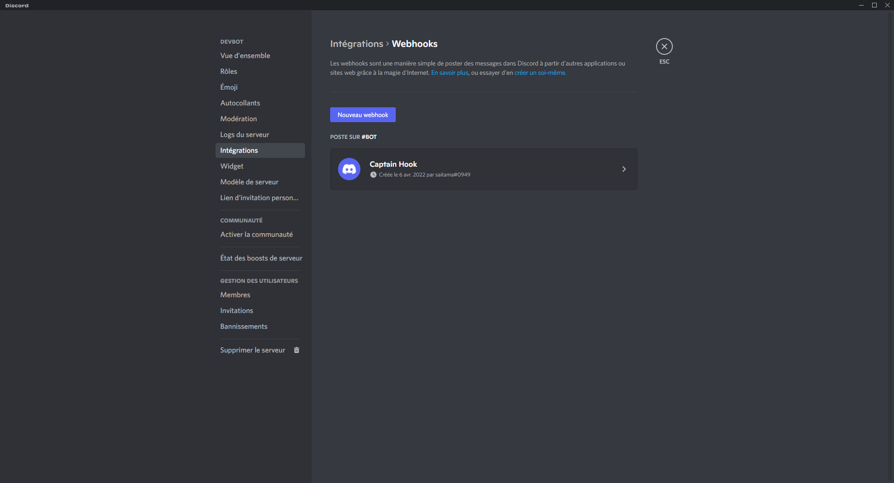
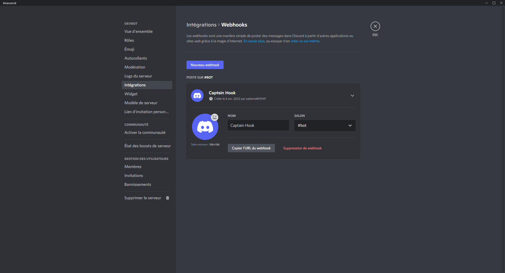

# How to create a webhooks on discord 

1. click here then server parameters 

 

2. Click here : integration 

 

3. click on <strong style="color:red;">new webhooks</strong> :

 
 

## Result

at this moment you can retrieve the adresse of your webhooks, basically that's a simple API's wich allow you to receive message from external application and then perform tasks base on this requests on your discord server. So in opposition of discord bots this is usefull for everything who need to perform tasks sometime base on event coming from others apps or monitoring when discord bots are usefull for performing tasks base on event receive inside your discord himself. One is async base (discord bot), when the other one can be use even with sync code that's can be usefull if you want to thread your task for example you can use webhooks to write a message inside a chanel when a components drop (like a PS5 for example) because when your scraper will find an availability you will basically send an https requests to your webhooks wich is basically a API's for interact with your bot on discord, then the bot will send a message to notify your community.

 
 

## Sources

* [How to Receive Webhooks with Python](https://www.youtube.com/watch?v=HQLRPWi2SeA)
* [How to send webhooks with Python](https://www.youtube.com/watch?v=X-_25tzo8Cw)
* [Using discord webhooks with python](https://www.youtube.com/watch?v=smJS_SU6KzY)
* [webhooks full course for beginner [FCC]](https://www.youtube.com/watch?v=41NOoEz3Tzc)
* [Discord Webhooks | Nextcord and Discord.py](https://www.youtube.com/watch?v=wysbyiGNQHE)
* [Webhook for Discord with Python](https://www.youtube.com/watch?v=B712bxQ_9y8)
